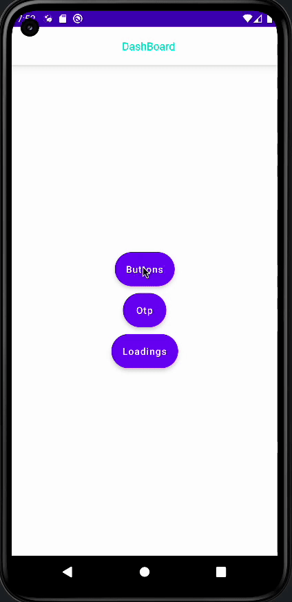
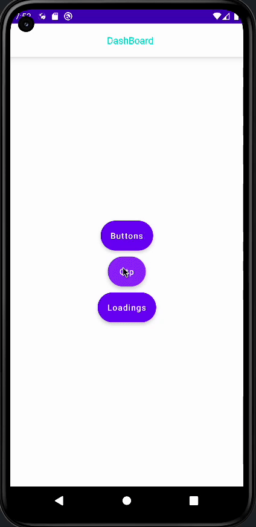
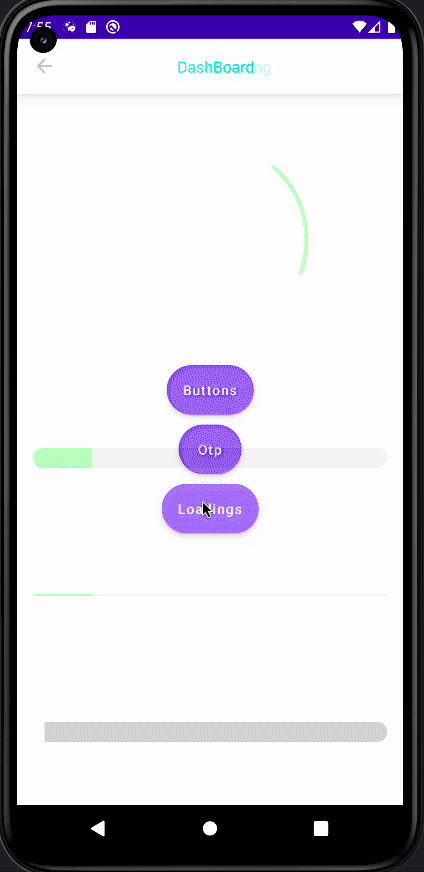

 
  <a href="https://github.com/othneildrew/Best-README-Template">
  <h1 align="center">Jetpack Compose Component Box</h1>
  
  
  
  
  
  
  

  
 ## About The Project ℹ️
  
This project is a project where you can find and use custom components in Jetpack Compose. Our goal is to add and use components and some custom components that are used many times.
You can also contribute by opening a PR. What you need to do is to open a pr and develop a preview component. That is all!

## Contribution 💪🏻
All contributions are welcome! Feel free to jump to the issues and pick one for yourself! Please write a comment inside of the issue before you start working.

## Rules 🔖
* 1 - To contribute to the Component Box repo, first open a branch as feature/component-name.
* 2 - Open a package file in the components package specific to the component.
* 3 - Before opening the PR, the Components you write must have a @Preview view.
* 4 - After the PR is open, add the name of the component you wrote to the Readme.md file under Features.

## Screens 📱

 
  
  

## Features 👀
- Otp Component | [Code](https://github.com/merttoptas/Jetpack-Compose-Component-Box/blob/master/app/src/main/java/com/merttoptas/jetpack_compose_component_box/components/otp/CustomOtpContainer.kt)
- Custom Elevated Button Component | [Code](https://github.com/merttoptas/Jetpack-Compose-Component-Box/blob/master/app/src/main/java/com/merttoptas/jetpack_compose_component_box/components/buttons/CustomElevatedButton.kt)
- Custom Elevated Button Component | [Code](https://github.com/merttoptas/Jetpack-Compose-Component-Box/blob/master/app/src/main/java/com/merttoptas/jetpack_compose_component_box/components/buttons/CustomElevatedButton.kt)
- Gradient Button Component | [Code](https://github.com/merttoptas/Jetpack-Compose-Component-Box/blob/master/app/src/main/java/com/merttoptas/jetpack_compose_component_box/components/buttons/GradientButton.kt)
- Outlined Button Component | [Code](https://github.com/merttoptas/Jetpack-Compose-Component-Box/blob/master/app/src/main/java/com/merttoptas/jetpack_compose_component_box/components/buttons/OutlinedButton.kt)
- Circular Loading Bar Component | [Code](https://github.com/merttoptas/Jetpack-Compose-Component-Box/blob/master/app/src/main/java/com/merttoptas/jetpack_compose_component_box/components/loading/CircularLoadingBar.kt)
- Horizontal Loading Bar Component | [Code](https://github.com/merttoptas/Jetpack-Compose-Component-Box/blob/master/app/src/main/java/com/merttoptas/jetpack_compose_component_box/components/loading/HorizontalLoadingBar.kt)
- Line Loading Bar Component | [Code](https://github.com/merttoptas/Jetpack-Compose-Component-Box/blob/master/app/src/main/java/com/merttoptas/jetpack_compose_component_box/components/loading/LineLoadingBar.kt)
- Story Loading Bar Component | [Code](https://github.com/merttoptas/Jetpack-Compose-Component-Box/blob/master/app/src/main/java/com/merttoptas/jetpack_compose_component_box/components/loading/StoryLoadingBar.kt)
- Expandable Card Component | [Code](https://github.com/merttoptas/Jetpack-Compose-Component-Box/blob/master/app/src/main/java/com/merttoptas/jetpack_compose_component_box/components/card/ExpandableCard.kt)

## Contributors 👏
* [tfaki](https://github.com/tfaki)
* [cengiztoru](https://github.com/cengiztoru) 
* [halilozel1903](https://github.com/halilozel1903)
* [nisaefendioglu](https://github.com/nisaefendioglu)

